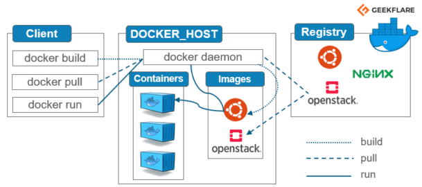
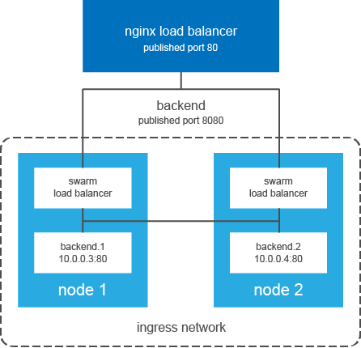

# Docker Swarm

## Documentation
Documentation for this code base can be found [here](https://www.youtube.com/watch?v=YYfefejSgWY&list=WL&index=1)

## Explanation
This tutorial covers the use cases of docker swarm as a container orchestrator.

## Tips
### Architecture



### Docker Swarm init
```
docker init
```
This commands will enable docker on your computer. This will enable the computer to be the manager. You can check to see if docker swarm is active on your computer by using this command:

```
docker info | grep -i swarm
```
It will show how you can have worker nodes join your swarm or how to set another manager node after you initialize the manager.

### Docker services


#### Get swarm services
In order to see if any services on the swarm are active you can use this command:
```
docker service ls
```

To show the containers or services active in the swarm you can use this command:
```
docker service ps <service name>
```

To inspect a service or find out details about the service you can use this command:
```
docker service inspect -pretty <service name>
```


#### Set swarm services
To create a new service you can use this command:
```
docker service create -p <host port>:<container port> --name <service name> <image>
```

If no specified number of nodes are given then only one will be made. In order to specify the number of nodes then you can use this command:
```
docker service create --name <service name> --replicas=<number of replicas> <image>
```

#### Global mode for services
A global service runs one replica per node on all the nodes in the swarm with no prespecified number of tasks/nodes. Every new node added will get the replica created and vice versa. To perform this use the command:
```
docker service create -p 80:80 --name <service> --mode global <image>
```

#### Update swarm services
To update or scale the swarm with containers you can use the command:
```
docker service scale <service name>=<number>
```

#### Update/Rolling updates for services
When updating a service you can define how many containers should be updated at a time and what should happen if the new containers start failing. To roll back to the previous version of a service use the commands:
```
docker service update --image <image> <service>
docker service update --replicas=<number> <service>
docker service update --rollback <service>
docker service update --update-failure-action=rollback <service>
```

#### Remove swarm services or swarm
In order to delete a service you can use the command:
```
docker service rm <service name>
```

### Docker nodes


#### Roles
- Blank: worker node
- Leader: Manager node (primary)
- Reachable: Candidate to become a leader node (promote)
- Unavailable: Manager node that cannot communicate with other nodes
- DRIAN: Do no assign/create containers

#### Get docker nodes
To get the docker nodes use the command:
```
docker node ls
```

To inspect a node use the command:
```
docker node inspect <node>
```

#### Set a docker node
To promote or demote a node use the command:
```
docker node promote <node>
docker node demote <node>
```

#### Update a docker node
To update the docker node use the command:
```
docker node update --availability drain <node>
docker node update --availability active <node>
```

### Docker stack
#### Get the stack
To get the stack list, stack processes, stack services use the command:
```
docker stack ls
docker stack ps <stack name>
docker stack services <stack name>
```

#### Set the stack
To set the stack use the command:
```
docker stack deploy -c docker-compose.yml <stack name>
```

#### Delete the stack
To remove a stack use the command:
```
docker stack rm <stack name>
```

### Docker swarm service discovery and load balancing



The swarm manager uses ingress load balancing to expose the services you want to make them available externally to the swarm. The ingress controller will do round robin by default.

